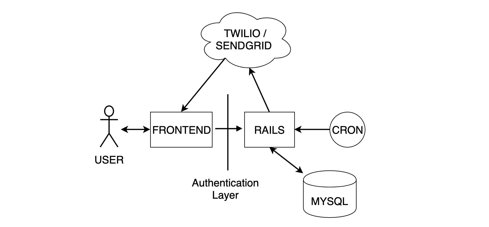

# SpendingAlert
> A notification service that alerts users when their spending is too high

People have finances spread across multiple accounts. Many services like Intuit, Yodlee and MxTechnologies provide API's to aggregate and collect financial information.

## Table of Contents

- [Requirements](#requirements)
- [Clone](#clone)
- [Setup](#setup)
- [Technology](#technology)
- [License](#license)


## Requirements

- Ruby v2.5.1
- Rails 5.2.0
- MySql 5.7

## Clone

- Clone this repo to your local machine using `https://github.com/jscho13/spendingalert`


## Setup

This repo has a number of API integrations. To get it locally you'll need to developer API keys to:
- [Stripe.com](https://stripe.com/)
- [Twilio](https://www.twilio.com/)
- [SendGrid](https://sendgrid.com/)
- [MxTechnologies](https://data.mx.com/)

Place these in a `.env` file or as a Heroku configuration to get the app running.

> Install required gems and start the server

```shell
$ bundle install
$ rails start
```

Last you'll need to setup a [cron job](https://en.wikipedia.org/wiki/Cron) that continuously runs `rake send_messages` to notify users.


## Technology

SpendingAlert connects with a wide-variety of API's to pull transaction information, send emails, handle payments/charges and process automated text-messages.
Below is a high-level overview of the codebases architecture.


Users initially interact with the frontend. Once they've passed the secure authentication layer, they can begin interacting with the backend. The backend has access to a MySql database for persistent data storage. Also on the server is a cron job that continuously runs a background task. This background task interacts with Twilio to send automated text-messages. In addition, Rails may directly interface with SendGrid to send emails for password resets, or account verification.


## License

[](http://badges.mit-license.org)

- **[MIT license](http://opensource.org/licenses/mit-license.php)**
- Copyright 2019 © <a href="https://www.linkedin.com/in/jscho13/" target="_blank">Joseph Cho</a>.
